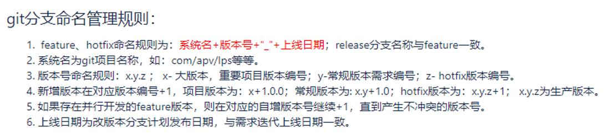
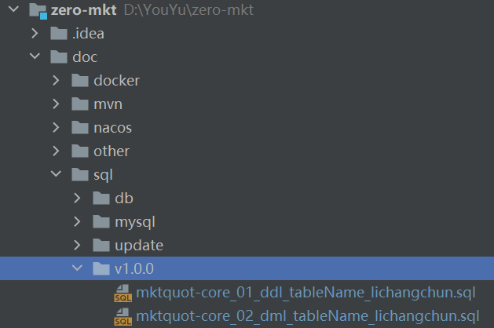

## 代码分支规范
    **！基础服务模块如果特殊需求，本次尽量不错改动 ！**

1. 版本基于master建版本分支，如：zero-biz1.0.0（暂不带上线日期），dev、stg、prd环境部署打包都从版本分支拉代码
2. 开发人员基于版本分支建自己的开发分支，如：zero-biz1.0.0_changchun，版本完成上线后删除开发分支，下个版本新建
3. 开发人员完成需求编码后先本地Commit，然后从版本分支pull代码，解决代码合并冲突后再push到自己的开发分支
4. 开发人员自行申请将自己开发分支的代码合并到版本分支进行联调或测试部署，需选择版本经理对代码合并进行审核
5. UAT验收通过后对版本分支代码进行封板，不允许再提交或合并代码；版本上线后由版本经理将版本分支合并到master分支
6. 如果存在版本并行情况，后上线的版本需要从master归并代码到版本分支（含数据库同步），解决冲突通知开发，并更新测试环境
7. 数据库脚本统一放到/doc/sql目录下面，按版本建目录，脚本文件命名规范：服务名_执行序号_脚本类型_表名_开发人员.sql

    说明：运维CICD部署根据版本号从GitLab拉版本分支代码打包，并从数据库脚本目录拿sql脚本执行  
    注意：已执行的脚本如果需要调整请写回滚脚本在下次部署时修正，不要去改原来的脚本

    缺数据库密码配置的加密与邮件推送SDK
